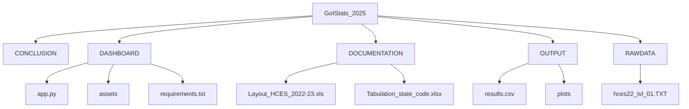
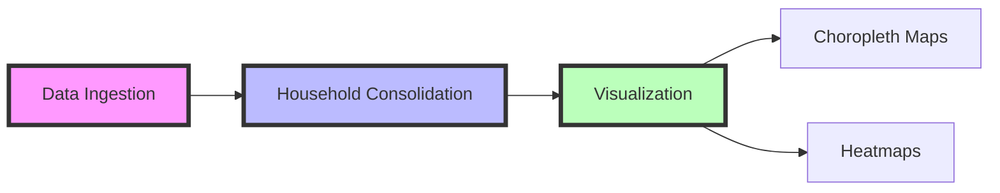
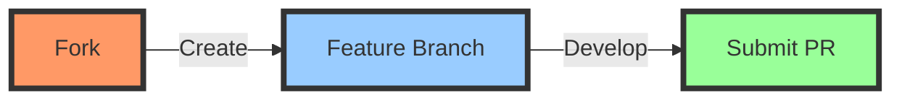

<div align="center">

# 🚀 INNOVATE WITH GOISTATS: HCES 2022-23

[]()
[]()
[]()
[]()

<p align="center">
  
</p>


</div>

<div align="center">

## 📚 Table of Contents

</div>

<details open>
<summary>Click to expand/collapse</summary>

- [⚡ Project Overview](#project-overview)
- [⚙️ Repository Structure](#repository-structure)
- [⚛️ Installation](#installation)
- [▶️ Getting Started](#getting-started)
- [📊 Data Processing & Visualization](#data-processing--visualization)
- [🔮 Dashboard Features](#dashboard-features)
- [♾️ Reproducibility](#reproducibility)
- [⚖️ Ethical Compliance](#ethical-compliance)
- [🤝 Contributing](#contributing)
- [📄 License](#license)
- [📞 Contact](#contact)

</details>

<div align="center">

## ⚡ Project Overview

</div>

> This project analyzes the Household Consumer Expenditure Survey (HCES) 2022-23 dataset to generate actionable insights for India's Viksit Bharat initiative.

<table align="center">
<tr>
<td align="center">
<br/>
<b>Digital Divide</b><br/>
Urban vs. rural internet penetration
</td>
<td align="center">
<br/>
<b>Expenditure Patterns</b><br/>
Consumption trends & subsidies
</td>
<td align="center">
<br/>
<b>Policy Tools</b><br/>
Evidence-based decision-making
</td>
</tr>
</table>

### 🌟 Key Features

<div align="center">

[]()
[]()
[]()

</div>

<div align="center">

## ⚙️ Repository Structure

</div>



<div align="center">

## ⚛️ Installation

</div>

### Prerequisites

<div align="center">

[]()
[]()

</div>

### Setup

```bash
# Clone the repository
git clone https://github.com/abhi-1408-shek/Innovate_with_GoIStats.git
cd Innovate_with_GoIStats

# Install dependencies
pip install -r DASHBOARD/requirements.txt
```

<div align="center">

## ▶️ Getting Started

</div>

<details open>
<summary><b>1. Data Preprocessing</b></summary>

```bash
python Untitled.py  # Generates OUTPUT/results.csv
```
</details>

<details open>
<summary><b>2. Launch Dashboard</b></summary>

```bash
streamlit run DASHBOARD/app.py  # Access at http://localhost:8501
```
</details>

<div align="center">

## 📊 Data Processing & Visualization

</div>



<div align="center">

## 🔮 Dashboard Features

</div>

### 🎛️ Interactive Filters

<table align="center">
<tr>
<td align="center">
<br/>
<b>State</b><br/>
36 states/UTs
</td>
<td align="center">
<br/>
<b>Sector</b><br/>
Urban vs. Rural
</td>
<td align="center">
<br/>
<b>Year</b><br/>
2020-2023
</td>
</tr>
</table>

### 📈 Visualization Tools

1. **Geospatial Analysis**
   - State-wise adoption heatmaps
2. **Policy Simulation**
   - Impact prediction models
3. **Real-Time Updates**
   - Dynamic data visualization

<div align="center">

## ♾️ Reproducibility

</div>

<table align="center">
<tr>
<td align="center">
<br/>
Version Control
</td>
<td align="center">
<br/>
Modular Code
</td>
<td align="center">
<br/>
Documentation
</td>
</tr>
</table>

<div align="center">

## ⚖️ Ethical Compliance

</div>

- 🔒 **Anonymization**: Removed sensitive identifiers
- 📜 **Data Usage**: MoSPI guidelines compliant
- ⚖️ **Licensing**: Raw data under NDA

<div align="center">

## 🤝 Contributing

</div>



<div align="center">

## 📄 License

</div>

[]()
[]()

<div align="center">

## 📞 Contact

</div>

<table align="center">
<tr>
<td align="center">
<br/>
<b>Team</b><br/>
Abhishek Sharma
</td>
<td align="center">
<br/>
<b>Email</b><br/>
abhishekpooja1408@example.com
</td>
<td align="center">
<br/>
<b>Issues</b><br/>
<a href="https://github.com/abhi-1408-shek/Innovate_with_GoIStats/issues">Report Here</a>
</td>
</tr>
</table>

<div align="center">

---

<p align="center">
  
</p>

</div>

